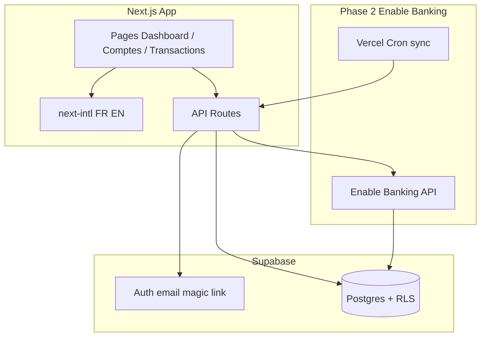

# Plan Flow Finance — tracker perso automatisé

## Contexte et objectifs

| Décision      | Choix                                                                       |
| ------------- | --------------------------------------------------------------------------- |
| Nom / repo    | **flow-finance** (renommer le dossier `finance-tracker` → `flow-finance`)   |
| Scope MVP     | Compte courant + livrets, transactions et soldes                            |
| Hors scope v1 | Investissements (PEA, AV, crypto)                                           |
| Stack         | Next.js 16 (App Router), TypeScript, Tailwind CSS, shadcn/ui, Supabase      |
| Banque        | Enable Banking (mode restreint, usage perso) — **phase 2**                  |
| UI            | **ui-ux-pro-max-skill** (design system « Personal Finance Tracker »)        |
| Langues       | FR + EN via **next-intl**                                                   |
| Qualité       | Code commenté (JSDoc + en-têtes de module), docs, README, commits atomiques |

---

## Phase 0 — Prérequis locaux (avant le code métier)

### 0.1 Renommer le projet

- Renommer `/Users/alexandre-pascal/Documents/Projets/finance-tracker` → `flow-finance`
- Ouvrir le nouveau dossier dans Cursor

### 0.2 Installer ui-ux-pro-max-skill

La skill n’est pas encore présente sur ta machine. Installation via CLI officiel :

```bash
npm install -g uipro-cli
cd flow-finance
uipro init --ai cursor
```

Cela génère notamment :

- [`.cursor/skills/ui-ux-pro-max/SKILL.md`](.cursor/skills/ui-ux-pro-max/SKILL.md) (ou équivalent projet)
- [`.cursor/commands/ui-ux-pro-max.md`](.cursor/commands/ui-ux-pro-max.md)
- données partagées dans `.shared/ui-ux-pro-max/`

**Usage pendant l’implémentation UI** : invoquer `/ui-ux-pro-max` avec le brief produit avant chaque lot d’écrans :

> « Personal finance tracker B2C, dashboard data-dense, trust & clarity, FR/EN, Next.js + Tailwind + shadcn, dark/light mode, éviter gradients AI fintech clichés »

La skill dispose d’une règle métier **Personal Finance Tracker** (catégorie Finance) : palettes sobres, patterns dashboard, anti-patterns banking documentés.

### 0.3 Comptes externes à créer (par toi)

- **GitHub** : repo vide `flow-finance` (public ou private)
- **Supabase** : projet gratuit + noter `SUPABASE_URL`, `SUPABASE_ANON_KEY`, `SUPABASE_SERVICE_ROLE_KEY`
- **Vercel** : lier le repo (pour URLs HTTPS Enable Banking plus tard)
- **Enable Banking** : garder l’app Production + `.pem` en attente (activation après Vercel)

---

## Architecture cible



### Structure de dossiers proposée

```
flow-finance/
├── .cursor/                    # ui-ux-pro-max-skill
├── docs/
│   ├── ARCHITECTURE.md
│   ├── DATABASE.md
│   ├── ENABLE_BANKING.md       # guide phase 2
│   ├── I18N.md
│   └── COMMENTING.md           # conventions commentaires
├── messages/
│   ├── fr.json
│   └── en.json
├── src/
│   ├── app/
│   │   ├── [locale]/           # routes i18n
│   │   │   ├── (auth)/
│   │   │   ├── (dashboard)/
│   │   │   │   ├── page.tsx           # vue d'ensemble
│   │   │   │   ├── accounts/
│   │   │   │   ├── transactions/
│   │   │   │   └── settings/
│   │   │   ├── privacy/page.tsx       # pages légales (EB futur)
│   │   │   └── terms/page.tsx
│   │   └── api/
│   │       ├── bank/                  # stubs phase 2
│   │       └── health/
│   ├── components/
│   │   ├── ui/                 # shadcn
│   │   └── features/           # composants métier commentés
│   ├── lib/
│   │   ├── supabase/
│   │   ├── enable-banking/     # client JWT + types (phase 2)
│   │   └── i18n/
│   └── types/
├── supabase/
│   └── migrations/
├── .env.example
├── README.md
└── CONTRIBUTING.md
```

---

## Phase 1 — Fondations (semaine 1)

### 1.1 Scaffold Next.js

- `npx create-next-app@latest` avec TypeScript, Tailwind, App Router, `src/`
- `npx shadcn@latest init -d --base radix`
- Composants de base : `button`, `card`, `table`, `dialog`, `dropdown-menu`, `sonner`, `skeleton`, `tabs`, `badge`, `select`

### 1.2 i18n (next-intl)

- Middleware locale : `/fr/...` et `/en/...` (défaut `fr`)
- Fichiers [`messages/fr.json`](messages/fr.json) et [`messages/en.json`](messages/en.json)
- Sélecteur de langue dans Settings
- Doc [`docs/I18N.md`](docs/I18N.md)

### 1.3 Supabase Auth + schéma DB

**Tables principales** (migration initiale dans [`supabase/migrations/`](supabase/migrations/)) :

| Table              | Rôle                                                     |
| ------------------ | -------------------------------------------------------- |
| `profiles`         | Préférences user (locale, devise)                        |
| `bank_connections` | Session EB, `valid_until`, statut (phase 2)              |
| `accounts`         | IBAN, nom, type (`checking` / `savings`), solde          |
| `transactions`     | `entry_reference` unique, montant, date, libellé, statut |
| `categories`       | Catégories perso + règles mot-clé                        |

**RLS** : chaque table filtrée par `auth.uid() = user_id`.

Indexes : `(account_id, booking_date)`, unique `(account_id, entry_reference)`.

### 1.4 Auth UI

- Login magic link Supabase
- Layout dashboard protégé (middleware)
- Page onboarding vide « Connecter ma banque » (bouton désactivé + message « bientôt »)

### 1.5 Design system (ui-ux-pro-max-skill)

Avant de coder les écrans :

1. Lancer `/ui-ux-pro-max` pour générer le design system **Personal Finance Tracker**
2. Appliquer : palette, typo (Google Fonts), layout Bento/dashboard, dark mode
3. Créer [`docs/DESIGN_SYSTEM.md`](docs/DESIGN_SYSTEM.md) — capture des choix (couleurs, espacements, composants)

**Écrans MVP phase 1** (données mock ou seed Supabase) :

- **Dashboard** : solde total, dépenses du mois, graphique simple (recharts)
- **Comptes** : liste courant + livrets
- **Transactions** : tableau filtrable, recherche, pagination
- **Paramètres** : langue, déconnexion, statut connexion bancaire

### 1.6 Documentation et qualité code

**Conventions commentaires** ([`docs/COMMENTING.md`](docs/COMMENTING.md)) :

- En-tête de fichier : rôle du module, dépendances externes
- JSDoc sur fonctions exportées (params, retour, effets de bord)
- Commentaires inline **uniquement** pour logique métier non évidente (dédoublonnage, sync, RLS)
- Pas de commentaires redondants (`// increment i`)

**README** ([`README.md`](README.md)) :

- Présentation, screenshots (placeholder)
- Prérequis, installation, variables d’env
- Scripts (`dev`, `build`, `lint`, `db:migrate`)
- Roadmap (phase 1 / 2 / 3)
- Licence MIT

**Autres fichiers** :

- [`.env.example`](.env.example) — toutes les vars sans secrets
- [`.gitignore`](.gitignore) — `*.pem`, `.env*`, `node_modules`
- [`CONTRIBUTING.md`](CONTRIBUTING.md) — conventions commits, branches

### 1.7 Git + commits

Initialiser git, premier push vers `github.com/<user>/flow-finance`.

**Stratégie commits** (conventional commits, petits lots logiques) :

```
chore: init next.js project
feat(i18n): add next-intl with fr/en routes
feat(db): add supabase schema and RLS policies
feat(auth): add magic link login flow
feat(ui): add dashboard layout with design system
docs: add architecture and setup guides
```

Tu demanderas explicitement les commits à chaque jalon — pas de commit automatique non sollicité.

---

## Phase 2 — Enable Banking (après déploiement Vercel)

Prérequis : app déployée sur `https://flow-finance-xxx.vercel.app`

### 2.1 Config Enable Banking

- Mettre à jour redirect URL : `https://.../api/bank/callback`
- Privacy / Terms : pages réelles [`/fr/privacy`](src/app/[locale]/privacy/page.tsx), [`/fr/terms`](src/app/[locale]/terms/page.tsx)
- Lier comptes CA (courant + livret, un par un)

### 2.2 Module [`src/lib/enable-banking/`](src/lib/enable-banking/)

- `jwt.ts` — génération JWT RS256 (clé privée env)
- `client.ts` — wrappers `POST /auth`, `POST /sessions`, `GET /transactions`
- `types.ts` — mapping réponses EB → modèle interne
- Doc détaillée [`docs/ENABLE_BANKING.md`](docs/ENABLE_BANKING.md)

### 2.3 Routes API

| Route                    | Rôle                                      |
| ------------------------ | ----------------------------------------- |
| `GET /api/bank/connect`  | Démarre OAuth EB, redirect banque         |
| `GET /api/bank/callback` | Échange `code` → session, upsert accounts |
| `POST /api/bank/sync`    | Pull transactions (cron + manuel)         |

**Première sync** : `strategy=longest` pour max d’historique.  
**Syncs suivantes** : `strategy=default` + `date_from`.

### 2.4 Cron Vercel

- `vercel.json` : sync quotidienne 6h UTC
- Alerte UI si `valid_until` < 14 jours

### 2.5 Limites documentées

- Consentement ~180 jours → reconnexion
- Historique souvent 90 jours en background (après fenêtre initiale)
- Mode restreint = tes comptes liés uniquement
- Pas de catégorisation EB → règles locales dans `categories`

---

## Phase 3 — Confort (optionnel post-MVP)

- Catégorisation auto (règles mot-clé : CARREFOUR → Alimentation)
- Budget mensuel par catégorie + alertes
- Export CSV des transactions
- Tests : Vitest sur parsers et dédoublonnage

---

## Variables d'environnement

```env
# Supabase
NEXT_PUBLIC_SUPABASE_URL=
NEXT_PUBLIC_SUPABASE_ANON_KEY=
SUPABASE_SERVICE_ROLE_KEY=

# App
NEXT_PUBLIC_APP_URL=http://localhost:3000

# Enable Banking (phase 2)
ENABLE_BANKING_APP_ID=
ENABLE_BANKING_PRIVATE_KEY=   # contenu PEM ou path
ENABLE_BANKING_REDIRECT_URL=
ENABLE_BANKING_ASPSP_NAME=
ENABLE_BANKING_ASPSP_COUNTRY=FR
```

---

## Coûts estimés

| Service                    | Side project |
| -------------------------- | ------------ |
| Enable Banking (restreint) | 0 €          |
| Supabase free              | 0 €          |
| Vercel hobby               | 0 €          |
| **Total**                  | **0 €/mois** |

---

## Ordre d'exécution recommandé

1. Renommer dossier + installer `uipro init --ai cursor`
2. Scaffold Next.js + shadcn + next-intl
3. Design system via `/ui-ux-pro-max` → `DESIGN_SYSTEM.md`
4. Supabase (schema, RLS, auth)
5. UI dashboard avec données mock
6. README + docs + `.env.example`
7. Init git + push GitHub
8. Déployer Vercel
9. Enable Banking (phase 2)
