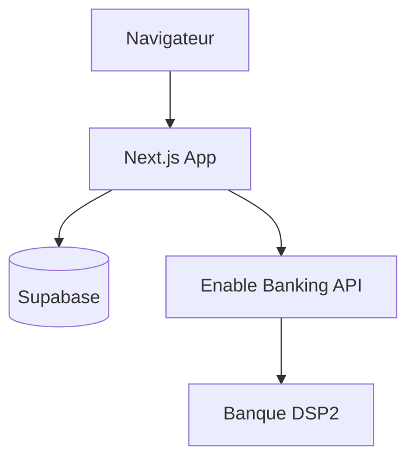

# Architecture — Flow Finance

## Vue d'ensemble

Application **Next.js App Router** monolithique : UI + API dans le même dépôt, données persistées dans **Supabase**.

## Dossiers clés

| Chemin | Rôle |
|--------|------|
| `src/app/[locale]/` | Pages UI avec préfixe locale (`/fr`, `/en`) |
| `src/app/api/` | Route Handlers (bank, health) |
| `src/lib/supabase/` | Clients browser, server, admin |
| `src/lib/enable-banking/` | JWT, client HTTP, sync |
| `src/components/features/` | Composants métier |
| `messages/` | Traductions FR/EN |
| `supabase/migrations/` | Schéma SQL versionné |

## Flux d'authentification

1. Utilisateur saisit son e-mail sur `/fr/login`
2. Supabase envoie un magic link
3. Callback `/auth/callback` échange le code contre une session cookie
4. Layout dashboard vérifie la session via `getAppUser()`

**Mode démo** : si `NEXT_PUBLIC_SUPABASE_URL` est absent, un utilisateur fictif est injecté.

## Flux bancaire (Enable Banking)

1. `GET /api/bank/connect` → redirect banque
2. Banque → `GET /api/bank/callback?code=...`
3. Création `bank_connections` + `accounts` dans Supabase
4. `syncUserTransactions(strategy: longest)` pour l'historique initial
5. Cron quotidien `POST /api/bank/sync` (header `Authorization: Bearer CRON_SECRET`)

## Sécurité

- RLS Supabase : isolation par `user_id`
- Clé privée Enable Banking **uniquement** côté serveur
- `CRON_SECRET` pour protéger le endpoint de sync
- Cookies OAuth state anti-CSRF

## Déploiement

Cible : **Vercel** avec `vercel.json` (cron). `NEXT_PUBLIC_APP_URL` doit être l'URL HTTPS de production pour Enable Banking.
